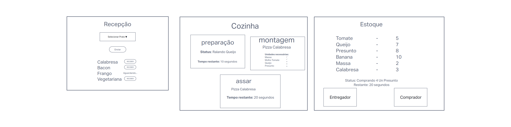
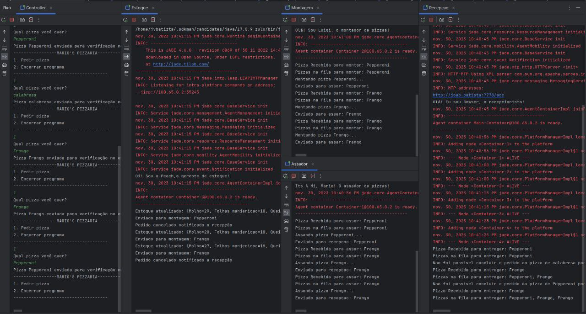

# Pizzaria Inteligente
Disciplina: FGA0210 - PARADIGMAS DE PROGRAMAÇÃO - T01
Nro do Grupo: 03
Paradigma: SMA

## Alunos
| Matrícula  | Aluno                             |
| ---------- | --------------------------------- |
| 19/0010606 | Artur de Sousa Vieira             |
| 19/0024950 | Arthur de Melo Garcia             |
| 19/0011424 | Carlos Eduardo Miranda Roriz      |
| 17/0032591 | Edvan Barreira Gomes Júnior       |
| 19/0109963 | João Victor Teixeira Batista      |
| 19/0112123 | Lucas Gabriel Sousa Camargo Paiva |
| 20/0023411 | Luíza Esteves dos Santos          |
| 16/0141842 | Philipe Rosa Serafim              |

## Sobre 
O Projeto consistem em aplicar o paradigma de multiagentes em um sistema de pizzaria, onde cada etapa tem um agente que é capaz de realizar atividades e se comunicarem entre si, visando atender pedidos de pizza dos clientes.
Inicialmente, nos reunimos e fizemos um esboço da nossa ideia inicial, para de fato termos uma ideia clara da melhor forma de lidar com o projeto: 


## Screenshots


## Instalação 
**Linguagens**: Java<br>
**Tecnologias**: Jade<br>


## Uso
Como primeiro passo, clone o repositório para a sua máquina:
```
git clone https://github.com/UnBParadigmas2023-2/2023.2_G3_SMA_PizzariaInteligente.git
``` 

Para executar o projeto, é necessário ter instalado  no seu dispositivo:
- Java 1.11
- JDK 18.0.2.1
- Apache Maven 3.9.6

Além disso, é preciso configurar para que o Maven reconheça o Jade como um framework seguro, permitindo que o Maven faça as indexações corretas e use sua bibliotecas. Para isso, basta adicionar o certificado do Jade no arquivo 'cacerts' do JDK. Uma cópia do certificado do jade pode se contrada neste reposotório em: "pizzariainteligente\src\assets\certs\jade.tilab.com", mas também pode ser gerada no seguinte site [https://jade.tilab.com/maven/].

Para executar esse passo, utilize o comando a seguir no mesmo diretório em que o certificado do Jade se encontra.
```
keytool -import -alias example -keystore "JAVA_PATH" -file ARQUIVO

```
- JAVA_PATH deve ser substituido pelo caminho do 'cacert'. Exemplo em dispositivos Windows:
```
 "C:\Program Files\Java\jdk-1.8\jre\lib\security\cacerts"
 ```
 - ARQUIVO deve ser substituido pelo nome do arquivo de certificado. 

Após executar esse comando, será solicitado uma palavra chave para senha, utilize _changeit_, após isso confirme que certificado é confiável digitando "sim" (pode ser "yes", varia de acordo com a lingua do Sistema Operacional).

Caso você esteja usando o IntelliJ, para configurar o Jade siga os passos do video [https://youtu.be/DJTJNHxFkvc?si=_iLiLgpJjZBXYW8v].

Concluidos esses passos, execute o build do projeto com:

```
mvn clean validate install
```

Após isso execute seguinte arquivo para rodar o projeto: 
```
pizzariainteligente\src\main\java\pizzariainteligente\Main.java 
```


## Vídeo


## Participações
Apresente, brevemente, como cada membro do grupo contribuiu para o projeto.
|Nome do Membro | Contribuição | Significância da Contribuição para o Projeto (Excelente/Boa/Regular/Ruim/Nula) |
| -- | -- | -- |
|Artur de Sousa Vieira | |  |
|Arthur de Melo Garcia |  |  |
|Carlos Eduardo Miranda Roriz |  |  |
|Edvan Barreira Gomes Júnior | Ajudou na configuração do maven, participou da construção do front e na tentativa de integração entre front e back |  |
|João Victor Teixeira Batista |  |  |
|Lucas Gabriel Sousa Camargo Paiva |  |  |
|Luíza Esteves dos Santos | |  |
|Philipe Rosa Serafim |  |  |

## Outros 
### Lições Aprendidas
- Paradigma Multifuncional: O grupo conseguiu entender a teoria e conseguir aplicar o paradigma em um projeto real, explorando suas especifidades

- Jade: Apesar das dificuldade de configuração, foi possível imergir um pouco mais sobre esse framework

- Trabalho em equipe: Se reunir para o desenvolvimento nos proporcionou uma grande troca de conhecimentos, o que aumentou o aprendizado de todos que colaboraram


### Percepções
De início o grupo teve muita dificuldade com as configurações atreladas com o pouco tempo. Conforme fomos nos reunindo, conseguimos resolver situações e colaborar com o projeto no geral.

### Contribuições e Fragilidades
Como contribuições, a nossa capacidade de escutar ideias diferentes e tomar a melhor decisão em conjunto nos fez contornar situações problemas durante o desenvolvimento;

Já em fragilidades, o grupo teve maior dificuldade na configuração de um ambiente uniforme e adequados para todos, uma vez que o framework escolhido possui muitas especifidades

### Trabalhos Futuros
- Interface gráfica: Trazer uma melhor apresentação dos dados, que no momento se encontra via terminal

- Criar id's para as pizzas: gerar id's que facilitem a identificação pelos usuários

## Fontes
Referencie, adequadamente, as referências utilizadas.
Indique ainda sobre fontes de leitura complementares.
